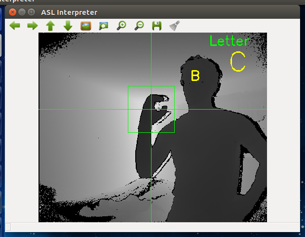

ASL-INTERPRETER
===
NOTE: I do not provide the samples because there are too many files. There is a sample generator in the `src` folder that you can use to create your own. Remember, the more diverse the samples are, the better the CNN or the SVM will perform. If you read the code and realise that there are missing folders, this is because they used to contain samples that I didn't include in this repo (size and count). `git` deletes any empty folder so this is why.

`asl` is a ROS package that detects and classifies static symbols (no gestures) from the American Sign Language through the use of OpenNI2, NiTE2, OpenCV2, Tensorflow and Kinect One (or Kinect for Windows). Anyone with a Kinect One can use this package to interact with a robot or computer with the use of ASL spelling (alphabet letters and numbers).

I have made a short jupyter notebook (`scripts/`) explaining the image processing used in this project.

# Requirements
In order to successfully build and run the package, you will need to install the following libraries:
  1. `ros-kinetic` : This package was built on `kinetic`. The features that were used in this package are mostly contained in `std_msgs` and `cv_bridge`. Previous versions of ROS should therefore be compatible too. Follow the instructions on the official website.
  2. `libfreenect2` : Driver for the Kinect One. Follow the instructions at https://github.com/OpenKinect/libfreenect2. 
  3. `openni2` : Although it is possible to use `libfreenect2` to access `rgb` and `depth` images from the Kinect, OpenNI2 provides useful natural interaction. Follow the instructions at https://github.com/occipital/openni2. Then, copy the content of `~/libfreenect2/build/lib/` to `~/OpenNI2/Bin/x64-Release/OpenNI2/Drivers/`. This will provide OpenNI2 the means to access the Kinect.
  4. `nite2` : NiTE2 is a library built on OpenNI2's framework that provides more natural interactions. It is used in this package to detect the position of the hand aswell as click gestures. Install it from https://bitbucket.org/kaorun55/openni-2.2/src/2f54272802bf/NITE%202.2%20%CE%B1/?at=master (`$ sudo ./install.sh`). Copy the content of `~/libfreenect2/build/lib/` to `~/NiTE-Linux-x64-2.2/Samples/Bin/OpenNI2/Drivers/`.
  5. `tensorflow` : Follow the instructions on the official website. I recommend using a virtual environment for `python`. `python3` is not used because ROS is compatible only with Python 2.
  6. Kinect One or Kinect for Windows : This is the camera that was used for this project. An adapter and a USB 3.0 port are required. The flexibility of `openni2` and `nite2` makes it possible to use any other compatible `rgb-d` cameras.

To make sure the following succeeded, try out the samples provided by `libfreenect2`, `openni2` and `nite2`.

# Installation
  1. Clone this repository and copy the `asl/` directory to `$YOUR_CATKIN_WORKSPACE/src/`.
  2. `$ catkin_make`

# Usage
If you would like to test the package right away, you will need either `rgb_logs` or `depth_logs` for the `cnn` or the trained models for the `svm`. To get them, you must retrain the CNN and the SVM with your own samples (again, too many files, so little space on github). Then, :
  1. Plug the USB 3.0 Kinect adapter to your computer.
  2. `$ roslaunch asl asl.launch` : This will run the ASL node (`src/main.cpp`). You should see the depth image with a wave sign.
  3. `$ roscd asl/scripts/SVM/` and then `$ python SVM_classify.py --type rgb`
  4. Wave at the camera until it detects your hand. Once detected, you can spell numbers. To spell letters, move your hand back and forth until it says `Letters` on the depth image. You can actually write by pressing `w`, reset by pressing `r` and chose between letters or numbers with `a` and `d`, respectively. It writes to the screen after 15 consecutive classifications.
  5. (optional) At this point, the `svm` with `rgb` images was used because they offer the best performance. You can try out the `cnn` with either `rgb` or `depth` images: `$ rosrun asl ASL depth`, `$ python CNN_classify.py --type depth`. Depending on the hardware you're using, you might have lower frame rate (~10 fps).

# Sample generation and retraining
In the package, there is a `sample_generator` node that will help build the dataset:
  1. `$ roscd asl`.
  2. `$ rosrun asl sample_generator <rgb or depth>` For rgb, raw images will be saved to `samples/training/rgb/raw/` and for depth, laplacian images of depth images will be saved to `samples/training/depth/`.
  3. Wave until detection and tracking.
  4. Press the letter or number that you wich to save. Hold down to have it save continuously. Do not make fast movements when saving rgb images because the registered image between depth and rgb will shift.
  5. You can view the generated rgb samples and the normalization effect by running `python scripts/sample_viewer.py`.

To retrain the classifiers, 
  1. Go to `scripts/` and chose the classifier.
  2. `$ python name_of_the_classifier`. For the SVM, simply change in the script the variable `ld=False` to retrain and not load the current model. Depending on the size of the dataset, the SVM will take between 5 to 30 seconds (every other sample was used in the script) to train whereas the CNN will take up to 3 hours. It is presumed that whoever is using this package is familiar with retraining the Inception CNN. The tutorials on Tensorflow's website explain everything in detail.
